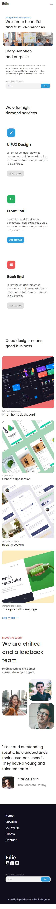
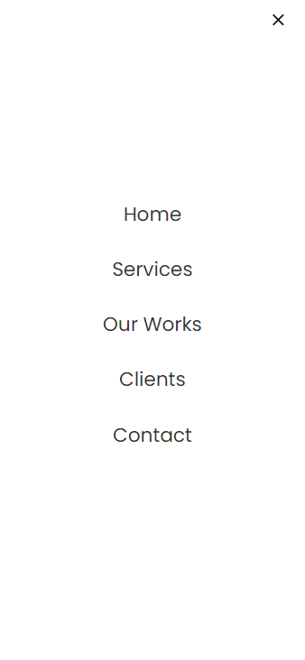

<!-- Please update value in the {}  -->

<h1 align="center">Edie homepage</h1>

<div align="center">
   Solution for a challenge from  <a href="http://legacy.devchallenges.io" target="_blank">Devchallenges.io</a>.
</div>

<div align="center">
  <h3>
    <a href="https://h-yoshikawa44.github.io/ch-edie-homepage/">
      Demo
    </a>
    <span> | </span>
    <a href="https://legacy.devchallenges.io/solutions/EQJ91PQg8nr6B3yfAPf1">
      Solution
    </a>
    <span> | </span>
    <a href="https://legacy.devchallenges.io/challenges/xobQBuf8zWWmiYMIAZe0">
      Challenge
    </a>
  </h3>
</div>

<!-- TABLE OF CONTENTS -->

## Table of Contents

- [Table of Contents](#table-of-contents)
- [Overview](#overview)
  - [Desktop](#desktop)
  - [Mobile](#mobile)
  - [Built With](#built-with)
- [Features](#features)
- [How To Use](#how-to-use)
- [learned/improved](#learnedimproved)
- [Acknowledgements](#acknowledgements)
- [Contact](#contact)

<!-- OVERVIEW -->

## Overview
### Desktop


### Mobile
top



menu



### Built With

<!-- This section should list any major frameworks that you built your project using. Here are a few examples.-->

- [HTML](https://developer.mozilla.org/ja/docs/Web/HTML)
- [CSS](https://developer.mozilla.org/ja/docs/Web/CSS)
- [JavaScript](https://developer.mozilla.org/ja/docs/Web/JavaScript)
- [Node.js](https://nodejs.org/)：22.13.1
- [Vite](https://ja.vitejs.dev/)：6.1.0

Other major libraries
- [material-design-icons](https://google.github.io/material-design-icons/)
- [wicg-inert](https://github.com/WICG/inert)
- [postcss-preset-env](https://github.com/csstools/postcss-plugins/tree/main/plugin-packs/postcss-preset-env)

## Features

<!-- List the features of your application or follow the template. Don't share the figma file here :) -->

This application/site was created as a submission to a [DevChallenges](https://legacy.devchallenges.io/challenges) challenge. The [challenge](https://legacy.devchallenges.io/challenges/xobQBuf8zWWmiYMIAZe0) was to build an application to complete the given user stories.

- [x] User story: I can see a page following the given design
- [x] User story: I can see a page on mobile following the given design
- [x] User story: I can go to certain locations by selecting links in navigation or footer

## How To Use

<!-- Example: -->

To clone and run this application, you'll need [Git](https://git-scm.com) and [Node.js](https://nodejs.org/en/download/) (which comes with [npm](https://www.npmjs.com/)) installed on your computer. From your command line:

```bash
# Clone this repository
git clone https://github.com/h-yoshikawa44/ch-edie-homepage.git
or
git clone git@github.com:h-yoshikawa44/ch-edie-homepage.git

# Install dependencies
npm install

# Run the Vite
npm run dev
```

## learned/improved
- Better, how to control the button outline during focus except for keyboard operation.
- Shifting techniques using negative margins.
- How to scroll with in-page links.
- How to set up a better fade-in, fade-out animation.

## Acknowledgements

<!-- This section should list any articles or add-ons/plugins that helps you to complete the project. This is optional but it will help you in the future. For example -->

- [Twitter - @NicMakesStuff - outline-color: transparent](https://twitter.com/NicMakesStuff/status/1462231545322741762?s=20)
- [画面幅いっぱいに画像をはみ出す方法](https://plus-creat.com/css-full-width/)
- [【jQuery無し】素のJSでページ内リンクをスムーススクロールさせる方法](https://web-dev.tech/front-end/javascript/anchor-link-smooth-scroll/)
- [【HTML/CSS】たかがフェードイン/フェードアウトするだけの挙動に全力で取り組んだ結果、最強のCSSができてしまった話【最強】](https://medium.com/eureka-engineering/html-css-%E3%81%9F%E3%81%8B%E3%81%8C%E3%83%95%E3%82%A7%E3%83%BC%E3%83%89%E3%82%A4%E3%83%B3-%E3%83%95%E3%82%A7%E3%83%BC%E3%83%89%E3%82%A2%E3%82%A6%E3%83%88%E3%81%99%E3%82%8B%E3%81%A0%E3%81%91%E3%81%AE%E6%8C%99%E5%8B%95%E3%81%AB%E5%85%A8%E5%8A%9B%E3%81%A7%E5%8F%96%E3%82%8A%E7%B5%84%E3%82%93%E3%81%A0%E7%B5%90%E6%9E%9C-%E6%9C%80%E5%BC%B7%E3%81%AEcss%E3%81%8C%E3%81%A7%E3%81%8D%E3%81%A6%E3%81%97%E3%81%BE%E3%81%A3%E3%81%9F%E8%A9%B1-%E6%9C%80%E5%BC%B7-881152c4ff13)

## Contact

- Website：[h-yoshikawa44.com](https://h-yoshikawa44.com)
- GitHub：[@h-yoshikawa44](https://github.com/h-yoshikawa44)
- Twitter：[@yoshi44_lion](https://twitter.com/yoshi44_lion)
